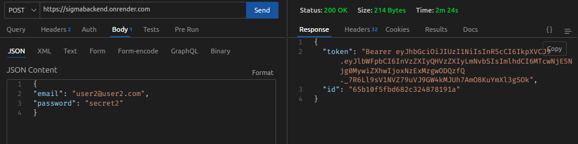
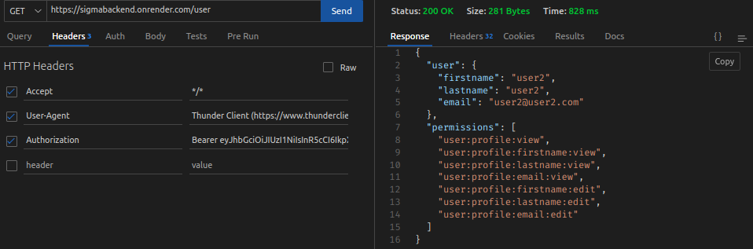
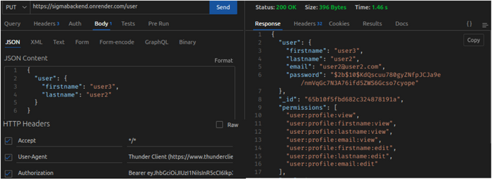

# Sigma Backend Challenge
## Technical challenge for the Sigma Program - Backend Component

<p>
  

  
  
  

   
The original challenge was a full-stack project, and considering the independence of its parts, I decided to first separate it into two sub-projects: the backend and the <a href="https://github.com/IgorMarinhoArgollo/sigma_frontend">Frontend</a>. The backend, which will be the focus of the project developed in this repository, essentially consists of a login route, a data display route (if the user has permission), and another route for user data editing (also if the user has permission). As auxiliary elements, but not part of the challenge, I also developed a route for creating users and another route for deleting users.

** It's important to note that your request may take longer than expected due to the OnRender (backend host) being on a free plan.

<br/>
  
### :earth_americas: Links
<a href="https://sigmabackend.onrender.com">Base</a><br>

### Routes
  - **Login:**
    - **Method:** PUT
    - **Endpoint:** "/"
    - **Requirements:**
      - **Request Body (example):** 
        ```json
        {
          "email": "user2@user2.com",
          "password": "secret2"
        }
        ```
    - **Description:** This route is used for user authentication and requires the user's email and password in the request body.

    <br>

    <br/>

- **Data Display:**
  - **Method:** GET
  - **Endpoint:** "/user"
  - **Requirements:**
    - **Request Headers:** 
      ```json
      {
        "Authorization": "Bearer <JWT Token>"
      }
      ```
  - **Description:** This route is used to retrieve user data and requires a valid JWT token in the authorization header.

    <br>
    
    <br/>

- **Data Edit:**
    - **Method:** PUT
    - **Endpoint:** "/user"
    - **Requirements:**
    - **Request Headers:** 
      ```json
      {
        "Authorization": "Bearer <JWT Token>"
      }
      ```
    - **Request Body (Example/ Each field Optional):** 
      ```json
      {
        "firstname": "user2",
        "lastname": "user2",
        "email": "user2@user2.com"
      }
      ```
  - **Description:** This route is used to edit user data and requires a valid JWT token in the authorization header. Each field in the request body is optional, and only fields provided will be updated if the user has authorization to edit.

<br />


### :computer: Used Technologies
  * 
  * 
  * 
  * 
  * 
  * 
  * Mongoose
  * BCrypt
  * DotEnv
  * Helmet
  * Rate-Limit<br><br>

### :gear: How to Run
  #### 1  Clone the repository (via SSH)
  On terminal:
  
    git clone git@github.com:IgorMarinhoArgollo/sigma_backend.git
  
  <br/>
  
  #### 2 Create .env file on folder
   **It's important to place your string connection to mongoDB connection**<br>
   Keys that must be included:
  
    PORT=3000
    MONGO_URI="<place Your String Connection Here>"
    JWT_SECRET="secret"

<br/>

  #### 3 Running Locally
  ##### Requirements:
   * node.js
   * a mongoDB account to create a Free DB and use it as cloud
  
  ##### Installing dependencies:
  On terminal:
  
    npm install

  ##### Connecting your mongoDB to the project
  Follow the 1 minute steps of the Youtube video to get your mongoDB connection String and place it on your .env file
 
    https://www.youtube.com/shorts/pIHvoXkwmq4

  ##### Starting
  On terminal:
  
    npm run dev

  <br />
  
  

### Images
- **/ (POST)**

<br>


<br>
<br />

- **/user (GET)**

<br>


<br>
<br />

- **/user/ (PUT)**

<br>


<br />


### :technologist: Author
<a href="https://www.linkedin.com/in/igormarinhoargollo/">
 
 <br />
 <sub><b>Igor Marinho Argollo</b></sub></a> <a href="https://www.linkedin.com/in/igormarinhoargollo/"></a>
 <br /> <br />

